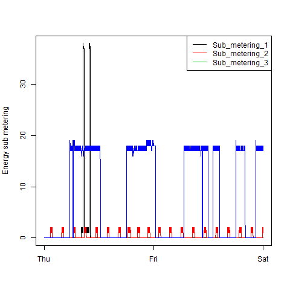
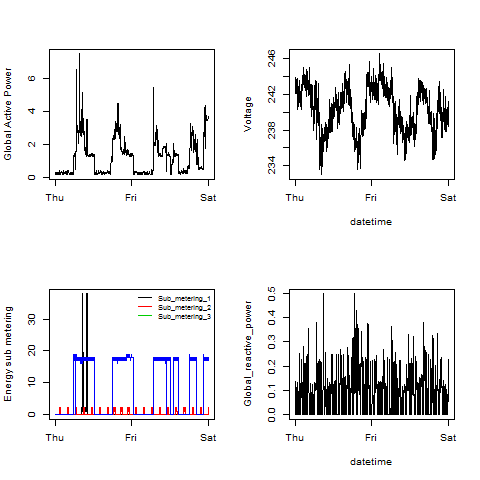

## Required Files
<ul>
<li>**readPowerData.R** - this file reads the data file and is used by all the plot scripts
<li>**plot1.R**
<li>**plot2.R**
<li>**plot3.R**
<li>**plot4.R**
</ul>

Assuming the scripts and the data file are in your working directory you can enter the following command to create each plot:
`source("plot#.R")`

Each plot script creates a file with the corresponding plot number.

### Plot 1

 

### Plot 2

 

### Plot 3

 

### Plot 4

 

